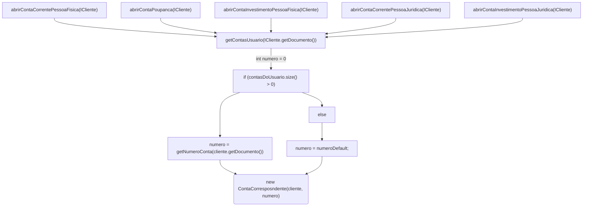

```mermaid
graph
A["abrirContaCorrentePessoaFisica(ICliente)"] --> F["getContasUsuario(ICliente.getDocumento())"]
B["abrirContaPoupanca(ICliente)"] -->F["getContasUsuario(ICliente.getDocumento())"]
C["abrirContaInvestimentoPessoaFisica(ICliente)"] -->F["getContasUsuario(ICliente.getDocumento())"]
D["abrirContaCorrentePessoaJuridica(ICliente)"] -->F["getContasUsuario(ICliente.getDocumento())"]
E["abrirContaInvestimentoPessoaJuridica(ICliente)"] -->F["getContasUsuario(ICliente.getDocumento())"]

F["getContasUsuario(ICliente.getDocumento())"] --> |int numero = 0| G["if (contasDoUsuario.size() > 0)"]
G["if (contasDoUsuario.size() > 0)"] --> H["getNumeroConta(cliente.getDocumento())"]
G["if (contasDoUsuario.size() > 0)"] --> I["else"]

I["else"] --> J["numero = numeroDefault;"]

H["numero = getNumeroConta(cliente.getDocumento())"] --> K("new ContaCorresposndente(cliente, numero)")

J["numero = numeroDefault;"] --> K("new ContaCorresposndente(cliente, numero)")   
```

Colocar lista de contas no Cliente.